---
title: Final Report
description: April 27, 2021
filename: final_report.md
--- 
[Homepage](/stock-market-predictions/)

[Project Proposal](/stock-market-predictions/pages/proposal)

[Midterm Report](/stock-market-predictions/pages/midterm_report)

# Introduction/Background

## Problem Definition
There are two problems that we are trying to solve using the S&P500’s 505 stocks as a dataset. Firstly, will clustering of stocks follow that of the 11 sectors defined within the S&P500, or will we find other trends? Secondly,  can we use supervised learning techniques on previous stock market data and its relevant technical indicators to accurately predict a stock’s price a 1-5 days into the future?

# Data Collection and Pre-Processing
Stock market data was easily pulled directly from Yahoo Finance’s libraries. This gives us access to the Open, Close, Adjusted Close, High, Low, and Volume data for a given stock at a daily resolution. A list containing all of the stock’s ticker symbols is used in combination with Pandas Datareader to pull the relevant data required for analysis.

## Data Cleaning
The data cleaning in this project is minimal since the data in this project is not messy. There is no missing data since each stock’s open, close, high, low, volume, and adjusted close is recorded for every day. The main data cleaning performed was to remove the first 20 days of the features, since many of the technical indicators need up to 20 days of data before returning results. For example, the 20-day Simple Moving Average returned NaN for the first 20 days, since there was not yet 20 days to perform this calculation.

## Data Preprocessing and Technical Indicators

In clustering analysis, stocks were compared based on respective movements. Movement is defined as such:

    

where Movement > 0 defines a net increase in price through the day and Movement < 0 defines a net decrease in price. 

Our supervised learning method makes use of 9 technical indicators to aid prediction models that are calculated based on pulled stock data from Yahoo Finance. The 9 technical indicators, the equations needed to calculate the indicator, and the indicator’s relevance are as follows:

1. Bollinger Bands:

    These bands widen and contract according to the volatility in the stock price. Where prices exceed the upper band, it is deemed to be a relatively high price, and the converse is true when prices exceed the lower band. 
    

        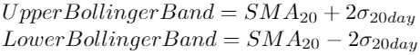
    

    

2. Commodity Channel Index (CCI)
    
    The CCI is used to identify cyclical turns across a range of asset classes as well as overbought/sold levels for securities.

    

        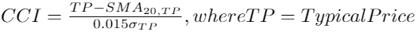
    

3. Ease of Movement (EVM)

    EVM is a volume-based oscillator that indicates the ease at which prices rise and fall.
    
    

        
    

4. Force Index

    Force Index is an oscillator that measures buying and selling pressure based on volume, direction of stock price, and the extent of price movement.

    

        
    

5. Moving Averages (SMA)

    The moving average is generated over a specified period and is recalculated daily based on the average closing price across the required number of days. We use 5 different types of moving averages throughout our analysis.

    **Simple Moving Average 5-day**
    
    

        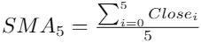
    

    **Simple Moving Average 20-day**

    

        
    

    **Simple Moving Average Ratio**

    

        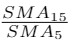
    

    **Exponentially-weighted Moving Average 5-day**

    

        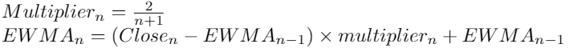
    

    **Exponentially-weighted Moving Average 20-day**

    

        
    

6. Moving Average Convergence Divergence (MACD)
    
    MACD generates a trend analysis based on the convergence or divergence of two Exponentially-weighted Moving Averages.

    

        
    

7. Rate of Change (ROC)

    ROC measures the percentage change in prices between a given date’s price and that of n days prior. The sign of ROC indicates either a bearish or bullish signal.

    

        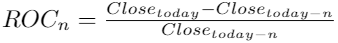
    

# Methods

## K-Means Clustering
We attempt to use a K-means clustering algorithm to cluster the stocks based on similarity within daily stock movements. Within the S&P500, there are 505 stocks classified within 11 different industrial sectors. We are interested to see if daily stock movement follows sector trends across the board, or if only certain stocks stand out within each cluster. In this midterm, we have run the algorithm on a small subset of the 505 stocks in an attempt to ensure that our model is working. We are currently running our model on 100 stocks that were selected based on the top 50, and bottom 50, stocks ranked based on the company’s market capitalization. Each stock’s daily stock movement is calculated according to the equation stated above and summed up. A positive movement value across the analyzed time period indicates a general increase in stock prices. This translates to an investor most typically wanting to go long on that particular stock instead of shorting it. 

This sum is then normalized with a normalizer since stock prices across the different stocks have different scales. This allows us to compare stocks directly. PCA reduction is used to reduce the high dimensional data with multiple features (253 features)  to one that is just 2-dimensional with 2 features. Although this reduces the accuracy and some details are lost, it allows us to use significantly less computational power to run our model and gives an easy visualization for our results. 

## Long Short-Term Modeling (LSTM)
Long Short-Term Modeling is one of the preferred methods for predicting stock closing prices. The first step we did was accumulate the dataset using all 18 indicators (6 from Yahoo Finance, and 12 technical indicators derived from Yahoo Finance). Then the dataset was scaled for each indicator from 0 to 1. The dataset was split into testing and training data, due to the quantity of stock data that is available, but difficulty of prediction, we used a 75%-25% split between training and testing data. The training set inputs contain the scaled data for each indicator, for the 60 days prior to the prediction day, this is tested against the data on the 61st day of that stock. The number of days in the LSTM model were varied to minimize error. In order to ensure the testing and training data was equally spread out, every fourth day in the dataset was used for testing.
 
An LSTM model from Keras was used to run the neural network. The output dimension of this LSTM model varied from 100 to 500 dimensions. Next, the model used Densely connected neural networks, the default we used was a hidden layer of 5 times the number of indicators, followed by an output layer the same size as the number of indicators. The size and number of Densely connected neural networks was also varied in order to minimize error. The model was evaluated using mean squared error. 
 
Lastly, the LSTM model was run using the results from the K-means clustering to determine the effectiveness of an LSTM model trained with one stocks data, tested against another stocks data. To perform this analysis, one stock was chosen from each K-means clustering algorithm. Then, the LSTM model was trained with each stock, and tested to determine the error when tested against other stocks. This process then repeated with various stocks in the same category.

# Results
## K-Means Clustering
Before any analysis was performed, it was important to normalize the movement of the selected stocks since the scale for the price can vary significantly. The non-normalized and normalized movement graphs can be seen below, which clearly demonstrates the purpose of these operations. 

    <b>Non-Normalized Movement</b> 
    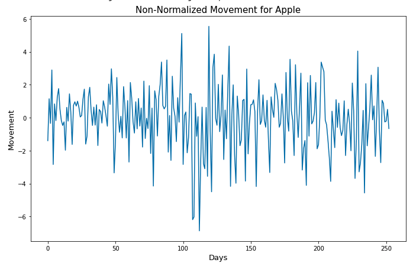
    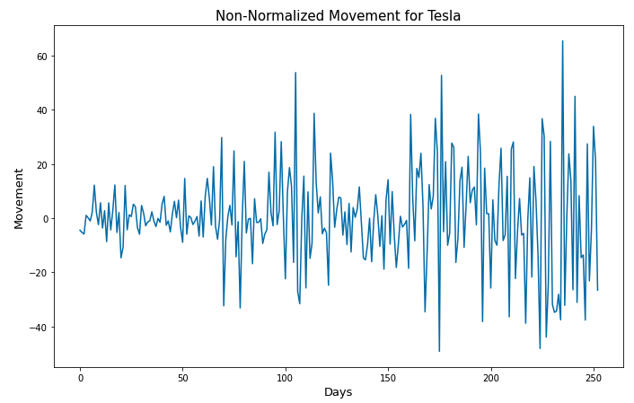

    <b>Normalized Movement</b> 
    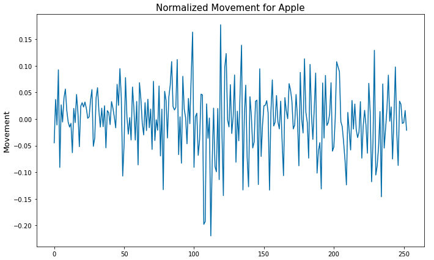
    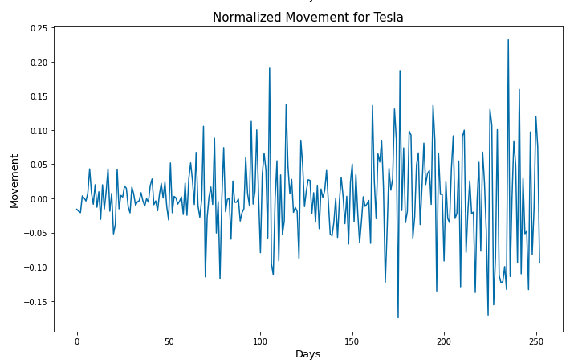

Initially, the K-means clustering analysis was performed without such normalization, which yielded undesired results; the plot of such clustering can be seen below:

    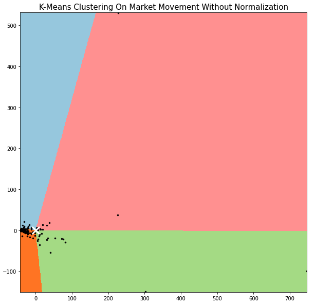     

After recognizing the need for normalization, another clustering analysis was performed. The 100 selected stocks were separated in 6 clusters. This number of clusters was selected based on the approximate number of sectors that these stocks belong to. As a result of such clustering, the  companies were split up the following way:

    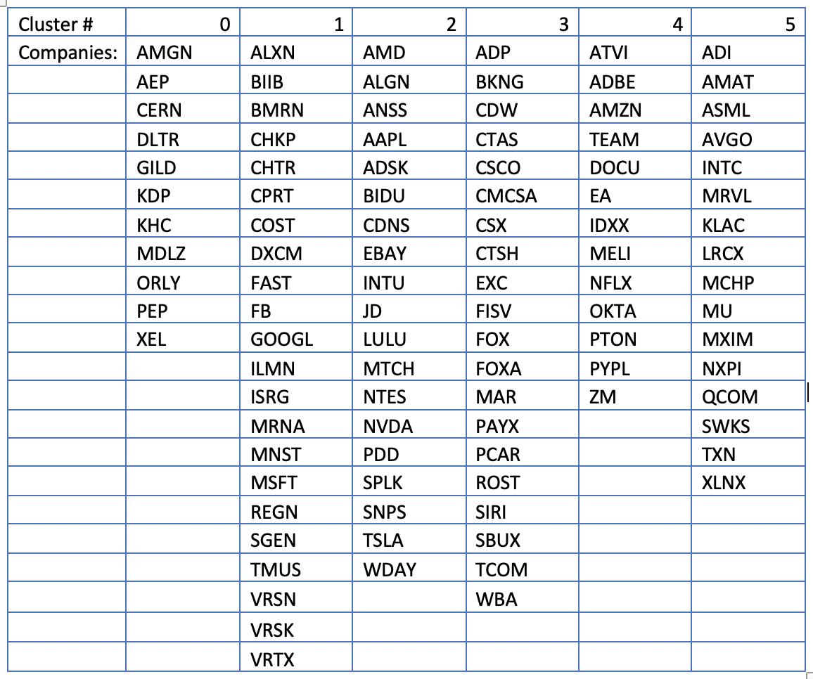     

The stocks were approximately split based on their performance throughout the year. More analysis will have to be performed before the final stage on the exact parameters for such clustering, but the price changes throughout the year is the initial hypothesis, which qualitatively makes sense; however, as previously mentioned, a more extensive technical analysis will be performed. The plot for K-means clustering with normalized price movements is provided below. 

    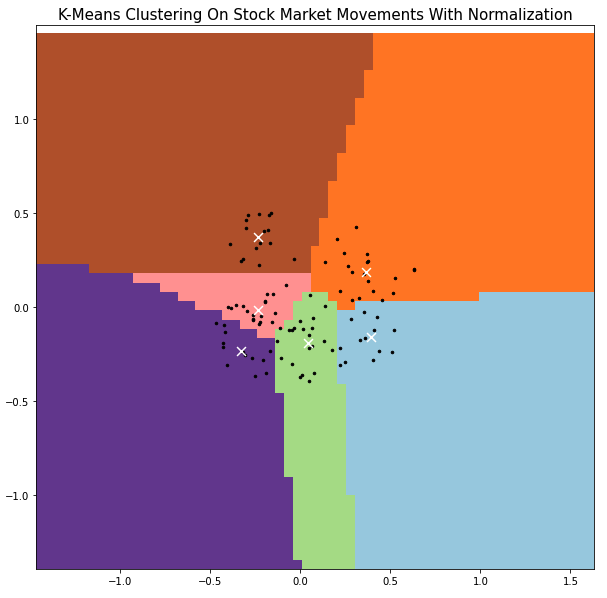     

## LSTM
Results varied a lot depending on the chosen stock and the input parameters. We discussed the three default starting settings above:

1. A 60 day LSTM window
2. 200 as the dimension of hidden state vector
3. A single hidden layer of 5 times the number of indicators

Since neural networks are prone to overfitting, we wanted to make sure to change each one of these settings and observe the results.
 
Here’s an example of running the algorithm on Apple and TSLA from 2014 to 2021:

1. Window = 60 days (1080 input variables)
2. Hidden state vector dimension = 200
3. 1 hidden layer with output dimensions = 90 (5 per indicator) and an output layer with dimension = 18 (one per indicator)

    
    
    &nbsp;&nbsp;&nbsp;
    

There were, however, some surprising results. For example, from the second half of 2019 until present day, TSLA has been a very volatile stock. To see if this impacted the error, we only ran the algorithm from 2014 to mid-2019 with the same parameters:

1. Window = 60 days (1080 input variables)
2. Hidden state vector dimension = 200
3. 1 hidden layer with output dimensions = 90 (5 per indicator) and an output layer with dimension = 18 (one per indicator)

    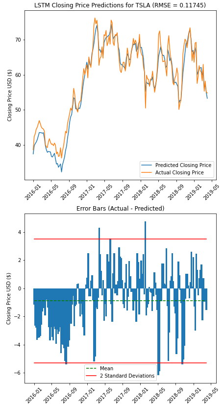

As observed, the root mean squared error actually went up. This was surprising because volatility usually makes stock prices harder to predict, which did not happen in this case.
 
Another surprising result was running the algorithm on TSLA from 2014 to 2021 without a hidden layer.

1. Window = 60 days (1080 input variables)
2. Hidden state vector dimension = 200
3. Output layer with dimension = 18 (one per indicator)

    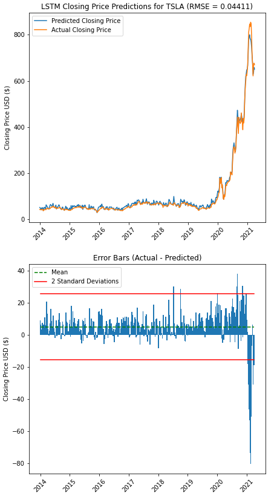     

This gave our best result since it had the lowest root mean squared error among all the TSLA parameter changes made. This is surprising because adding LSTM hidden layers supposedly makes the model deeper, and more of a deep learning technique.

In the end it is obvious that choosing the best parameters for the LSTM will vary based on the data (the stock and its time frame). We can estimate however, that the model parameters that worked consistently well were:
1. Window = 60 days (1080 input variables)
2. Hidden state vector dimension = 200
3. 1 hidden layer with output dimensions = 54 (3 per indicator) and an output layer with dimension = 18 (one per indicator)

To show this I’ll run this analysis on one stock from each KMeans cluster. 

    <b>AMGN from Cluster 0</b>
     
         

 

    <b>BIIB from Cluster 1</b>
     
         

 

    <b>AAPL and TSLA from Cluster 2</b>
     
    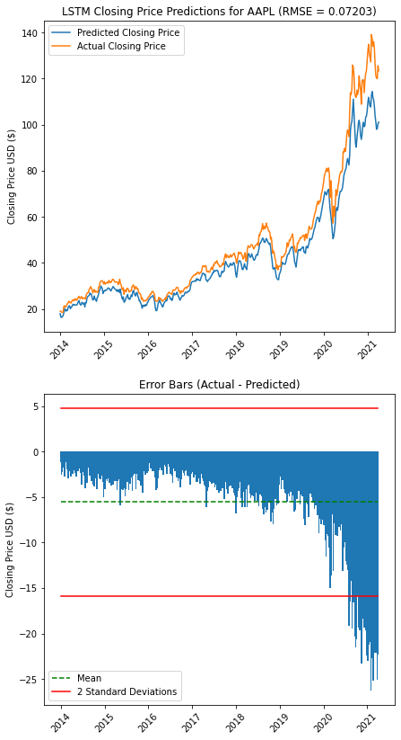 
        &nbsp;&nbsp;&nbsp;
    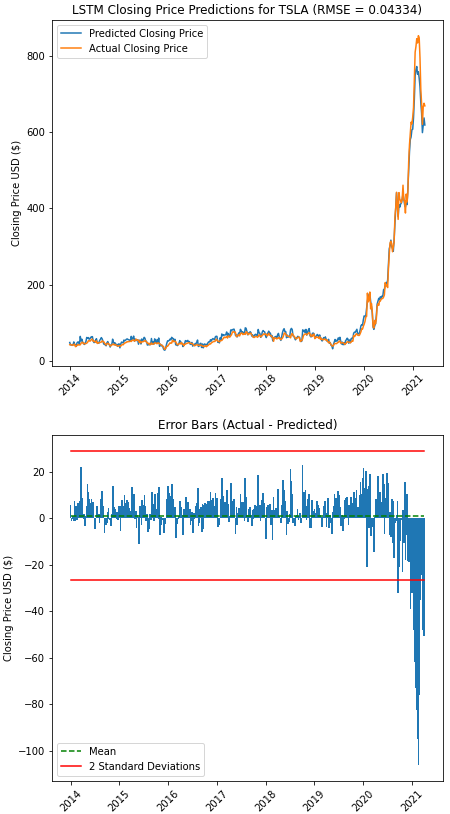    

 

    <b>ADP from Cluster 3</b>
     
         

 

    <b>CSX from Cluster 4</b>
     
    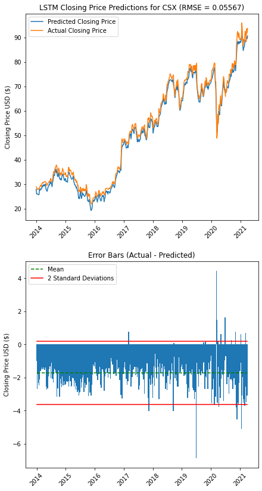     

 

    <b>LCRX from Cluster 5</b>
     
         

 

## K-Means Clustering Evaluation using LSTM
The first new results show the comparison of training the LSTM model on one stock, and testing the LSTM model on a stock of a **different** category. For this analysis, 6 random stocks were selected, one from each category from the K-means analysis. Then, the model was run 36 times so each stock was compared as the testing and training stock compared to all other stocks. The model used a hidden state vector dimension of 200, hidden layer output dimension of 54, and 60 day window, this was not the most accurate model, but had reasonable accuracy for the runtime speed and is sufficient for comparing errors between stocks.

 

    <b>Mean square error of stocks trained and tested against stocks in different categories</b>
     
    

The second new results show the comparison of training the LSTM model on one stock, and testing the LSTM model on a stock of the **same** category. For this analysis, 24 random stocks were selected, four from each category from the K-means analysis. Then, the model was run 24 times. The stock that was used in the ‘different category analysis’ was the only training stock, and then the testing stock varied in each test. This model also used a hidden state vector dimension of 200, hidden layer output dimension of 54, and 60 day window.

 

    <b>Mean square error of stocks trained and tested against stocks in the same category</b>
     
    

Below is an example of the new results visualizations, these results appear similar to the results of the previous section, as the only difference is the training and testing stocks are different. For example, the visualization below shows a stock that was trained with AMZN stock data, then tested against AGMN stock data. The RSME value of 0.07326 can be found in the tables above.

 

    <b>Stock data accuracy for model trained with AMZN and tested with AMGN</b>
     
    

 

# Discussion

## K-Means Clustering
The overall findings from the K-means clustering show that the stocks in each cluster were split based on two main parameters: their performance throughout the year and the industry/sectors they belong to. More in-depth analysis will have to be conducted in the next couple of weeks to determine the exact correlation between the clusters formed and the aforementioned parameters. However, certain patterns and interconnectedness of stocks within each cluster can already be clearly seen. 
 
For example, AAPL, TSLA, SNPS, INTU were all grouped in Cluster #2, and they are all software or big tech stocks that experienced a nose dive, but then significant growth during the coronavirus pandemic. ZM, PTON, DOCU, and NFLX on the other hand were grouped together into Cluster #4, which we refer to as the pandemic cluster. Nearly all these stocks were well-positioned to grow during the coronavirus pandemic (i.e. Zoom with its video conferencing platform and Peleton with its home workout stationary bicycles, and Netflix with its home entertainment streaming service). Cluster #5 almost exclusively consists of semiconductor manufacturing companies (AMAT, ADI, INTC, NXPI, AVGO, MCHP, XLNX, etc.). Of the prominent semiconductor manufacturers, only AMD and NVDA are missing from this cluster, which can be explained by the fact that these two companies significantly outperformed the average trend in this sector due to their chips being used in the new generation of gaming consoles. 
 
Lastly, we reiterate on the importance of the normalization of the price movements prior to performing the K-means analysis. The consequent steps for such analysis would be to run the algorithm on a larger array of stocks, test different parameters (change the number of clusters as well as the parameters for the dimensionality reduction algorithm), and perform a more in-depth quantitative analysis on the correlation between stocks within each cluster, which will ultimately help us determine the usefulness of the obtained data. 

## LSTM

The overall findings from the neural network was that it is extremely difficult to accurately predict the next day's stock closing price. After varying several of the parameters, we found that 60 days was not the optimal amount of time to use in prediction, and only using 30 days of data actually increased accuracy. Furthermore, we found that a densely connected hidden layer decreased accuracy as well. The larger LSTM output dimensions increased the accuracy, but it also led to much longer run times for the model. Lastly, we found that volatile stocks were harder to predict than stable stocks. Below is an example of predictions for April 1st, 2021 (the day after the midterm report for this project was due) stock data for AAPL. 

    High Prediction: 123.96113
    Low Prediction: 123.550385
    Open Prediction: 123.82444
    Close Prediction: 122.549904
    Volume Prediction: 36871924.0

The actual stock market data on this was actually…

    High: 124.18
    Low: 122.49
    Open: 123.66
    Close: 123.00
    Volume: 74957400

Below is an example of predictions for April 28th, 2021 (the day after the final report for this project was due) stock data for AAPL. To check the accuracy of these projected results, please visit: https://finance.yahoo.com/quote/AAPL/history.

    High Prediction: 130.49356
    Low Prediction: 126.34177
    Open Prediction: 127.9119
    Close Prediction: 129.41696
    Volume Prediction: 100858020.0

Note that this model was trained without using the prior 60 days for both models, so the neural network predicted the stock data to be much lower than it will likely be in actuality due to the recent volatile nature of the stock market compared to historical data.

## K-Means Clustering Evaluation using LSTM

The findings from the LSTM analysis of K-means clustering showed 2 general conclusions. First off, the accuracy of the models when trained with other stock data was surprisingly close to the accuracy of the models when trained with its own stock data. This does make sense as stock data movements are generally similar across all stocks, so it makes sense that the specific stock used to train the model matters less than one might think. However, the best accuracy of the model was always when the training and testing stock was the same, so there is incentive to train and test a model with the same stock to maximize accuracy. This first finding has implications in stock market machine learning because models may be able to experiment with using several stocks as features for one training model, since the trends appear to be replicable across different stocks.

The second finding was that stocks tested against stocks trained in the same category had greater accuracy than stocks tested against stocks trained in different categories. Also, these results showed that some categories did not represent the trends in other categories well, while some categories translated across the entire stock market well. For example, Category 5, which was mostly semiconductor manufacturers, had very poor accuracy when QCOM was the training data for other stocks. Note that only a small random sample of comparisons were performed since the model does have some significant runtime, but overall the relationships between and within categories are extremely interesting to analyze. Overall, this analysis does show that the K-means clustering results did translate to the LSTM model results, and it shows how unsupervised and supervised learning algorithms can be effectively used in conjunction with each other.

# Final Remarks
Overall, it can be concluded that the short term stock market forecasting our group created can be reasonably accurate, but is not accurate enough to inform trading decisions. Stock markets are volatile by nature and thus cannot be modeled purely with historical stock market data. To increase accuracy in future work, stock market forecasters may need to use more complicated artificial intelligence or introduce new dependent variables. For example, in our next steps we would look to introduce natural language processing to perform sentiment analysis on related news articles, social media, and other external data sources. This approach would require more advanced machine learning techniques, such as Naive Bayes or deep learning, to classify opinions, as well as data scraping and data cleaning.

Our K-means model, LSTM model, and analysis of the relation between K-means and LSTM demonstrate our groups ability to utilize ML techniques to obtain meaningful results as shown in our results section, and explained in our discussion section.
