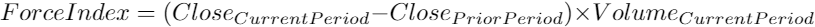
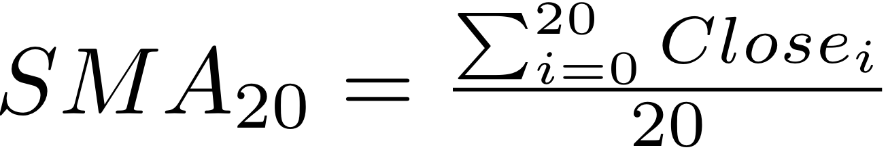
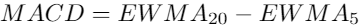
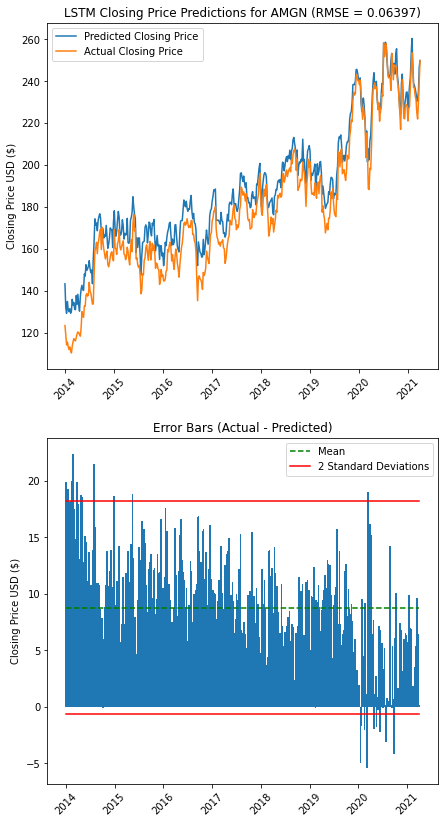

---
title: Midterm Report
description: April 8, 2021
filename: midterm_report.md
--- 
[Homepage](/stock-market-predictions/)

[Project Proposal](/stock-market-predictions/pages/proposal)

# Introduction/Background
Stock markets are highly volatile in nature: millions of market participants are united in attempting to maximize returns through informed financial decisions. With the recent increase in availability of market data, various computational techniques are being studied for predicting stock movements. In this Midterm Update, we have gathered the data necessary, calculated the required technical indicators, set up K-means clustering and a neural network as a prediction model. 

## Problem Definition
There are two problems that we are trying to solve using the S&P500’s 505 stocks as a dataset. Firstly, will clustering of stocks follow that of the 11 sectors defined within the S&P500, or will we find other trends? Secondly,  can we use supervised learning techniques on previous stock market data and its relevant technical indicators to accurately predict a stock’s price a 1-5 days into the future?

# Data Collection and Pre-Processing
Stock market data was easily pulled directly from Yahoo Finance’s libraries. This gives us access to the Open, Close, Adjusted Close, High, Low, and Volume data for a given stock at a daily resolution. A list containing all of the stock’s ticker symbols is used in combination with Pandas Datareader to pull the relevant data required for analysis.

## Data Cleaning
The data cleaning in this project is minimal since the data in this project is not messy. There is no missing data since each stock’s open, close, high, low, volume, and adjusted close is recorded for every day. The main data cleaning performed was to remove the first 20 days of the features, since many of the technical indicators need up to 20 days of data before returning results. For example, the 20-day Simple Moving Average returned NaN for the first 20 days, since there was not yet 20 days to perform this calculation.

## Data Preprocessing and Technical Indicators

In clustering analysis, stocks were compared based on respective movements. Movement is defined as such:

where Movement > 0 defines a net increase in price through the day and Movement < 0 defines a net decrease in price. 

Our supervised learning method makes use of 9 technical indicators to aid prediction models that are calculated based on pulled stock data from Yahoo Finance. The 9 technical indicators, the equations needed to calculate the indicator, and the indicator’s relevance are as follows:

1. Bollinger Bands:

    These bands widen and contract according to the volatility in the stock price. Where prices exceed the upper band, it is deemed to be a relatively high price, and the converse is true when prices exceed the lower band. 
    
    

2. Commodity Channel Index (CCI)
    
    The CCI is used to identify cyclical turns across a range of asset classes as well as overbought/sold levels for securities.

    

3. Ease of Movement (EVM)

    EVM is a volume-based oscillator that indicates the ease at which prices rise and fall.
    
    

4. Force Index

    Force Index is an oscillator that measures buying and selling pressure based on volume, direction of stock price, and the extent of price movement.

    

5. Moving Averages (SMA)

    The moving average is generated over a specified period and is recalculated daily based on the average closing price across the required number of days. We use 5 different types of moving averages throughout our analysis.

    **Simple Moving Average 5-day**
    
    

    **Simple Moving Average 20-day**

     

    **Simple Moving Average Ratio**

    

    **Exponentially-weighted Moving Average 5-day**

    

    **Exponentially-weighted Moving Average 20-day**

    

6. Moving Average Convergence Divergence (MACD)
    
    MACD generates a trend analysis based on the convergence or divergence of two Exponentially-weighted Moving Averages.

    

7. Rate of Change (ROC)

    ROC measures the percentage change in prices between a given date’s price and that of n days prior. The sign of ROC indicates either a bearish or bullish signal.

    

# Methods

## K-Means Clustering
We attempt to use a K-means clustering algorithm to cluster the stocks based on similarity within daily stock movements. Within the S&P500, there are 505 stocks classified within 11 different industrial sectors. We are interested to see if daily stock movement follows sector trends across the board, or if only certain stocks stand out within each cluster. In this midterm, we have run the algorithm on a small subset of the 505 stocks in an attempt to ensure that our model is working. We are currently running our model on 100 stocks that were selected based on the top 50, and bottom 50, stocks ranked based on the company’s market capitalization. Each stock’s daily stock movement is calculated according to the equation stated above and summed up. A positive movement value across the analyzed time period indicates a general increase in stock prices. This translates to an investor most typically wanting to go long on that particular stock instead of shorting it. 

This sum is then normalized with a normalizer since stock prices across the different stocks have different scales. This allows us to compare stocks directly. PCA reduction is used to reduce the high dimensional data with multiple features (253 features)  to one that is just 2-dimensional with 2 features. Although this reduces the accuracy and some details are lost, it allows us to use significantly less computational power to run our model and gives an easy visualization for our results. 

## Long Short-Term Modeling (LSTM)
Long Short-Term Modeling is one of the preferred methods for predicting stock closing prices. The first step we did was accumulate the dataset using all 18 indicators (6 from Yahoo Finance, and 12 technical indicators derived from Yahoo Finance). Then the dataset was scaled for each indicator from 0 to 1. The dataset was split into testing and training data, due to the quantity of stock data that is available, but difficulty of prediction, we used a 75%-25% split between training and testing data. The training set inputs contain the scaled data for each indicator, for the 60 days prior to the prediction day, this is tested against the data on the 61st day of that stock. The number of days in the LSTM model were varied to minimize error. In order to ensure the testing and training data was equally spread out, every fourth day in the dataset was used for testing.
 
An LSTM model from Keras was used to run the neural network. The output dimension of this LSTM model varied from 100 to 500 dimensions. Next, the model used Densely connected neural networks, the default we used was a hidden layer of 5 times the number of indicators, followed by an output layer the same size as the number of indicators. The size and number of Densely connected neural networks was also varied in order to minimize error. The model was evaluated using mean squared error. 

# Results
## K-Means Clustering
Before any analysis was performed, it was important to normalize the movement of the selected stocks since the scale for the price can vary significantly. The non-normalized and normalized movement graphs can be seen below, which clearly demonstrates the purpose of these operations. 

     

     

Initially, the K-means clustering analysis was performed without such normalization, which yielded undesired results; the plot of such clustering can be seen below:

         

After recognizing the need for normalization, another clustering analysis was performed. The 100 selected stocks were separated in 6 clusters. This number of clusters was selected based on the approximate number of sectors that these stocks belong to. As a result of such clustering, the  companies were split up the following way:

         

The stocks were approximately split based on their performance throughout the year. More analysis will have to be performed before the final stage on the exact parameters for such clustering, but the price changes throughout the year is the initial hypothesis, which qualitatively makes sense; however, as previously mentioned, a more extensive technical analysis will be performed. The plot for K-means clustering with normalized price movements is provided below. 

         

## LSTM
Results varied a lot depending on the chosen stock and the input parameters. We discussed the three default starting settings above:

1. A 60 day LSTM window
2. 200 as the dimension of hidden state vector
3. A single hidden layer of 5 times the number of indicators

Since neural networks are prone to overfitting, we wanted to make sure to change each one of these settings and observe the results.
 
Here’s an example of running the algorithm on Apple and TSLA from 2014 to 2021:

1. Window = 60 days (1080 input variables)
2. Hidden state vector dimension = 200
3. 1 hidden layer with output dimensions = 90 (5 per indicator) and an output layer with dimension = 18 (one per indicator)

    
         

There were, however, some surprising results. For example, from the second half of 2019 until present day, TSLA has been a very volatile stock. To see if this impacted the error, we only ran the algorithm from 2014 to mid-2019 with the same parameters:

1. Window = 60 days (1080 input variables)
2. Hidden state vector dimension = 200
3. 1 hidden layer with output dimensions = 90 (5 per indicator) and an output layer with dimension = 18 (one per indicator)

         

As observed, the root mean squared error actually went up. This was surprising because volatility usually makes stock prices harder to predict, which did not happen in this case.
 
Another surprising result was running the algorithm on TSLA from 2014 to 2021 without a hidden layer.

1. Window = 60 days (1080 input variables)
2. Hidden state vector dimension = 200
3. Output layer with dimension = 18 (one per indicator)

         

This gave our best result since it had the lowest root mean squared error among all the TSLA parameter changes made. This is surprising because adding LSTM hidden layers supposedly makes the model deeper, and more of a deep learning technique.

In the end it is obvious that choosing the best parameters for the LSTM will vary based on the data (the stock and its time frame). We can estimate however, that the model parameters that worked consistently well were:
1. Window = 60 days (1080 input variables)
2. Hidden state vector dimension = 200
3. 1 hidden layer with output dimensions = 54 (3 per indicator) and an output layer with dimension = 18 (one per indicator)

To show this I’ll run this analysis on one stock from each KMeans cluster. 

    <b>From AMGN from Cluster 0:</b>
         
     
    <b>BIIB from Cluster 1:</b>
     
         
    <b>BIIB from Cluster 1:</b>
    
    
    
         
    <b>BIIB from Cluster 1:</b>
         
    <b>BIIB from Cluster 1:</b>
         
    <b>BIIB from Cluster 1:</b>
         
    <b>BIIB from Cluster 1:</b>
         
    

# Discussion
## LSTM

