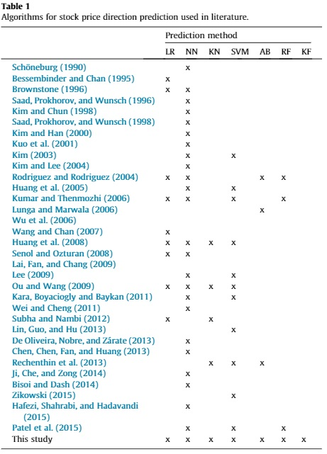
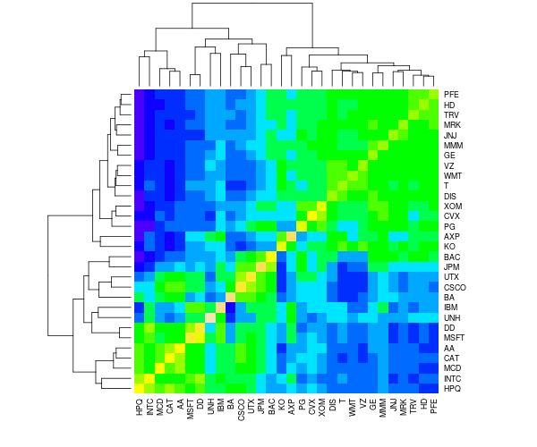

---
title: Midterm Report
description: April 8, 2021
filename: midterm_report.md
--- 
[Homepage](/stock-market-predictions/)

[Project Proposal](/stock-market-predictions/pages/proposal)

## Introduction/Background:
Stock markets are highly volatile in nature: millions of market participants are united in attempting to maximize returns through informed financial decisions. With the recent increase in availability of market data, various computational techniques are being studied for predicting stock movements. In this Midterm Update, we have gathered the data necessary, calculated the required technical indicators, set up K-means clustering and a neural network as a prediction model. 

## Problem Definition:
There are two problems that we are trying to solve using the S&P500’s 505 stocks as a dataset. Firstly, will clustering of stocks follow that of the 11 sectors defined within the S&P500, or will we find other trends? Secondly,  can we use supervised learning techniques on previous stock market data and its relevant technical indicators to accurately predict a stock’s price a 1-5 days into the future?
 
## Data Collection and Pre-Processing
Stock market data was easily pulled directly from Yahoo Finance’s libraries. This gives us access to the Open, Close, Adjusted Close, High, Low, and Volume data for a given stock at a daily resolution. A list containing all of the stock’s ticker symbols is used in combination with Pandas Datareader to pull the relevant data required for analysis.
In clustering analysis, stocks were compared based on respective movements. Movement is defined as such:

where Movement > 0 defines a net increase in price through the day and Movement < 0 defines a net decrease in price. 

## Methods:
The features used in both analyses will be added to by preprocessing methods: utilizing daily stock market data to calculate various technical indicators. Several different indicators, models, and model parameters will be tested in this project to optimize results.

Daily stock market data from the last 20 years for a group of stocks will be preprocessed based on methods described in both Choudhry-Garg (2008), and Peachavanish (2016)’s papers to create features that will be used for clustering analysis. Technical features include Rate of Change, Momentum and moving averages. Clustering analysis will be performed via GMM, K-means and other relevant methods. 

In answering our second question, this project will analyze the effectiveness of several supervised learning methods. Recently, the majority of stock price direction prediction literature has focused on Logistic Regression, Neural Networks, K-Nearest Neighbors and Support Vector Machines (Ballings, 2015). We plan to use similar methods in our analysis.

## Potential results:
The clustering analysis will provide results that allow for the categorization of different stocks, and help inform the supervised learning portion of the project. This could allow our supervised models to be evaluated on an overall scale, and on a cluster by cluster basis.

The results from the supervised learning should show the effectiveness of different machine learning models in predicting stock prices at different time steps into the future. The objective is to identify the model, model parameters, and features that predict stock market prices most accurately by comparison.

## Discussion:
Stock selection will be important to ensure a wide representation of sectors and industries. It is possible that certain stocks across different market sectors move similarly. This research could be useful for finding a kind of elasticity among stocks, which is useful for investors wanting to diversify their portfolios and discovering new ways to hedge risk.
 
In the supervised learning part, a big challenge will be pre-processing the financial data to include technical indicators. We will have to make sure to include pertinent features that will accurately predict the stock price movement, where the main difficulty is to not overfit the model. For future plans, it would be interesting to expand the stock selection, proposed models, and timescale of data to give a more detailed look on the relationship between different stocks and industries. 
 
 
 
 
## References:
1. Ballings, M., Poel, D. V., Hespeels, N., & Gryp, R. (2015, November 15). Evaluating Multiple Classifiers for Stock Price Direction Prediction. Expert Systems with Applications, pp. 7046-7056.
2. Choudhry, R., & Garg, K. (2008, January). A Hybrid Machine Learning System for Stock. World Academy of Science, Engineering and Technology, pp. 315-318.
3. Peachavanish, R. (2016, March 16-18). Stock Selection and Trading Based on Cluster Analysis of Trend and Momentum Indicators. Proceedings of the International Multiconference of Engineers and Computer Scientists.

